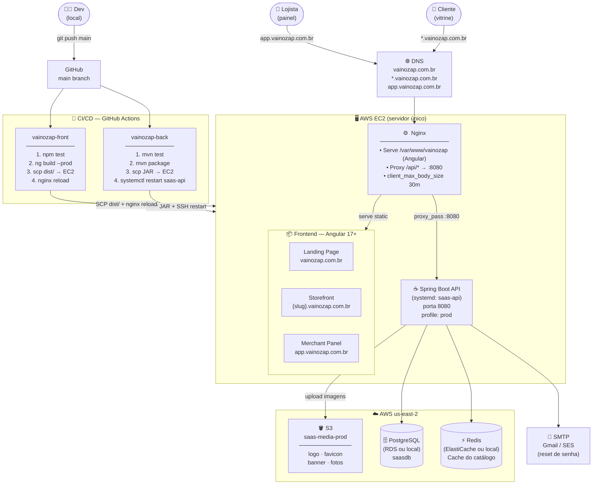
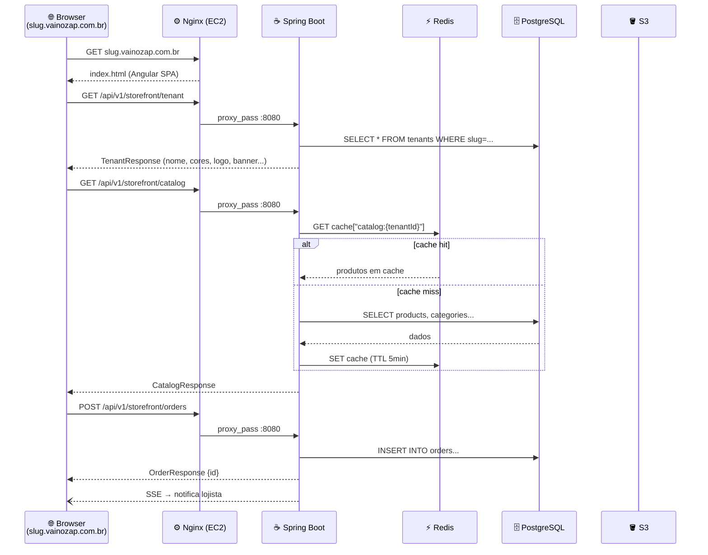
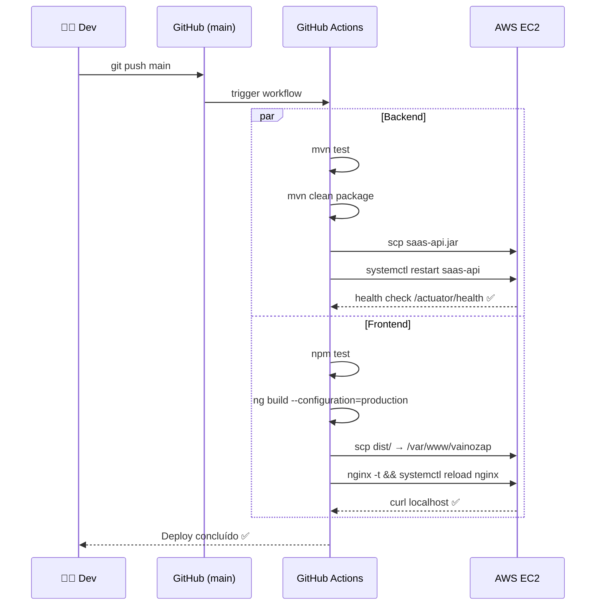
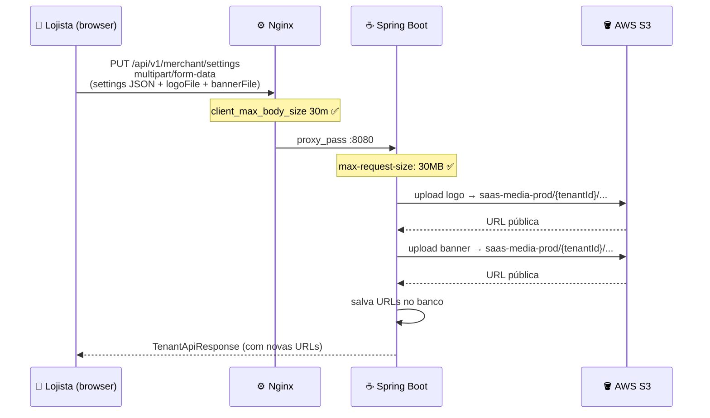

# Arquitetura do Sistema — Vainozap

> Gerado em Maio 2026

---

## Diagrama Geral

---

## Fluxo de uma Requisição — Vitrine Pública

---

## Fluxo de Deploy (CI/CD)

---

## Fluxo de Upload de Imagens

---

## Stack Resumida

| Camada | Tecnologia |
|---|---|
| **Frontend** | Angular 17+, Standalone Components, Signals |
| **Servidor web** | Nginx (proxy reverso + serve estático) |
| **Backend** | Spring Boot 3.x, Java 21, systemd |
| **Banco de dados** | PostgreSQL (Flyway V1–V15) |
| **Cache** | Redis (Spring Cache, TTL 5min) |
| **Armazenamento** | AWS S3 (`saas-media-prod`, us-east-2) |
| **E-mail** | SMTP Gmail / SES |
| **Notificações** | SSE — Server-Sent Events |
| **CI/CD** | GitHub Actions → SCP → EC2 |
| **Infraestrutura** | AWS EC2 (instância única) |
| **Auth** | JWT (access + refresh tokens, BCrypt) |
